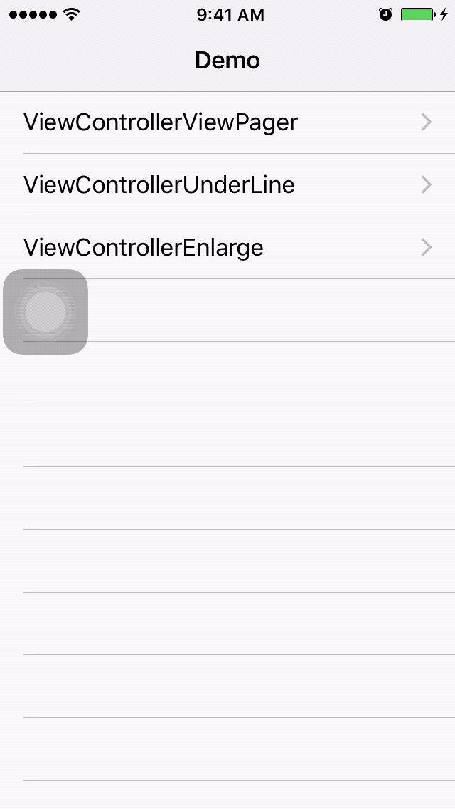

# LTViewPager

### Pager Tab, Like Netease News with three style

1. Color title		(use 'LTViewPagerController')
2. UnderLine		(use 'LTUnderLineController')
3. Title enlarge	(use 'LTEnlargeController')

### Insatallation

	pod 'LTViewPager'

### Usage

	LTUnderLineController *underLineController = [[LTUnderLineController alloc] init];
	
	ViewController *vc1 = [[ViewController alloc] init];
	vc1.title = @"vc1";
	[underLineController addChildViewController:vc1];
	
	ViewController *vc2 = [[ViewController alloc] init];
	vc2.title = @"vc2";
	[underLineController addChildViewController:vc2];
	
	[self.navigationController pushViewController:underLineController animated:YES];

### Sample Image

